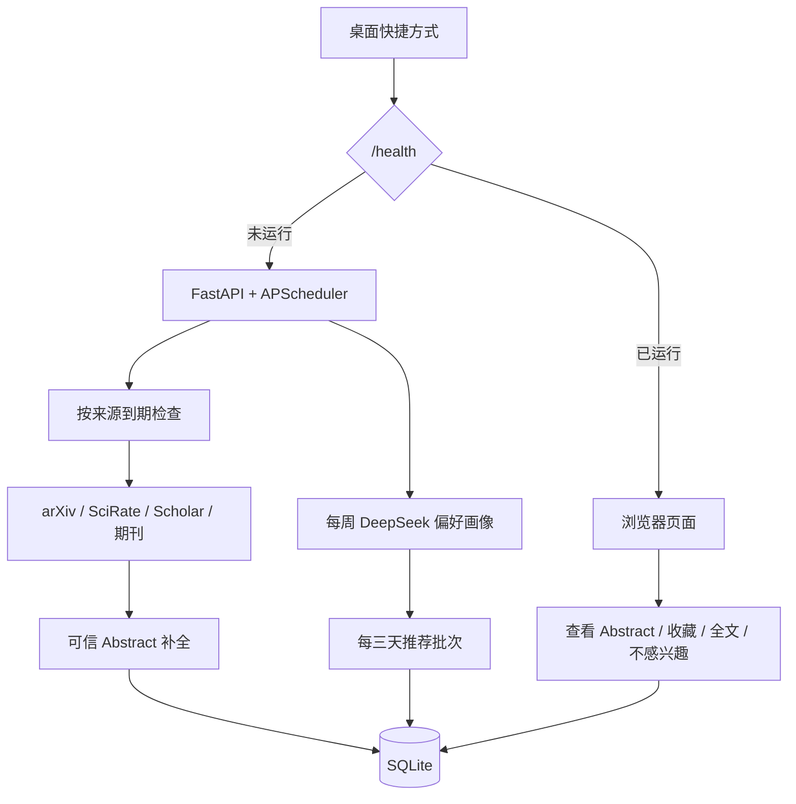

# 本地单用户架构

## 运行边界

- 只有本机 SQLite；配置会拒绝 PostgreSQL 等远端 URL。
- Uvicorn 只允许 `127.0.0.1`、`::1` 或 `localhost`，不暴露局域网或公网。
- `arxiv-updater serve` 是唯一常驻进程：网页与 APScheduler 在同一个进程中运行。
- 页面请求只读论文库或记录轻量互动；抓取、补摘要、偏好画像和推荐生成在后台任务中执行。

## 数据库

- `papers` 与 `paper_sources` 保存去重后的论文和来源记录。
- `interactions` 是单用户信号，且 `(paper_id, kind)` 唯一：`ABSTRACT_VIEWED`、`SAVED`、`FULLTEXT`、`DISMISSED`。
- `app_preferences` 是单例，保存手工兴趣及 DeepSeek 生成的可审计 JSON 画像。
- `source_schedules` 保存每个来源的间隔、成功/失败状态与下一次到期时间。
- `recommendation_batches`、`recommendation_items` 保存可复现的三日推荐结果和理由。
- `api_usage` 只记录服务与操作级用量，不含用户标识或 API key。

## 安全与恢复

API key 只从未跟踪的 `.env` 读取，不能写入数据库、日志、测试或 Git 历史。每次发现 SQLite migration 尚未执行前，程序先调用 SQLite backup API 生成完整备份，并通过 `PRAGMA integrity_check` 校验；迁移失败时停止启动。
