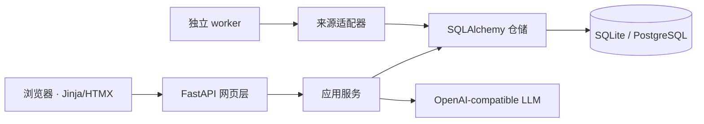

# 架构与扩展

项目刻意不引入 Node 或前端构建链。FastAPI 负责路由，Jinja2 生成 HTML，HTMX 只更新论文卡片局部，因此主要维护工作仍在 Python 中。

网页请求不会现场抓取论文来源。`worker` 或 `sync` 命令将所有外部记录转换为 `PaperCandidate`，再由统一 upsert/去重服务写库。来源同步失败只记录当前来源的 `SyncRun`，不影响网站读取最后一次成功的数据。

## 代码边界

- `sources/`：外部来源适配器，实现 `SourceAdapter.fetch(since)`。
- `services/papers.py`：规范化 ID、合并来源与幂等去重。
- `services/sync.py`：同步编排、断点续抓、来源失败隔离和 API 用量。
- `services/ranking.py`：无外部模型调用的个人排序。
- `services/llm.py`：可替换的 `LLMProvider`、结构化总结、缓存和额度。
- `web.py` 与 `templates/`：中文网页和 HTMX 交互。
- `models.py` 与 `alembic/`：共享数据模型和数据库版本。

## 新增来源

实现 `SourceAdapter`，把来源字段映射到 `PaperCandidate`，然后在 `services/sync.py` 注册。尽量提供稳定外部 ID、DOI 或 arXiv ID；最后兜底去重键才是规范化标题、首位作者与年份。适配器必须设置超时、固定 User-Agent、有限重试，并使用 fixture 测试解析器。

## 更换模型

设置 `LLM_BASE_URL`、`LLM_MODEL` 和 `DEEPSEEK_API_KEY` 即可切换任何兼容 OpenAI Chat Completions 的服务。模型输入仅有 title 和 abstract，输出必须符合固定 JSON 结构；通用结果按论文共享，但用量归因到首次生成的用户。DeepSeek V4 的摘要任务默认设置 `LLM_THINKING_ENABLED=false`，避免内部推理挤占结构化输出长度；只有确有需要时才开启。
