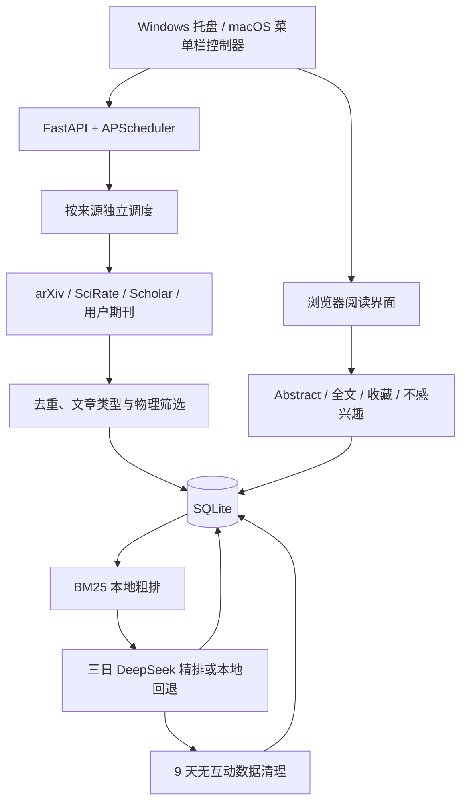

# 本地三日论文更新器架构

## 运行边界

- 只支持本机 SQLite，Uvicorn 只监听 `127.0.0.1`、`::1` 或 `localhost`。
- 开发模式使用 `arxiv-updater serve`；Windows `.pyw` 托盘控制器和 macOS 菜单栏控制器分别在同一生命周期内拥有 Uvicorn 与调度器。
- Windows 互斥量或 macOS 文件锁保证单实例，本机 IPC 只处理 `OPEN` 命令；控制器不会结束或接管未知端口进程。
- Windows 便携版把状态放在解压目录；macOS 封装版把状态放在 `~/Library/Application Support/arXiv Updater/`。macOS 登录自启是用户从菜单明确开启的用户级 LaunchAgent，使用 `--background` 启动且不会弹出浏览器。
- API key 只由设置页写入 Windows 凭据管理器或 macOS Keychain，不从项目配置文件读取。密钥不写入数据库、日志、页面或测试，关闭开关会让运行时配置返回空密钥。

## 主要数据流

- `papers` 与 `paper_sources` 保存去重论文和各来源标识；期刊论文同时保存文章类型和物理分类证据。
- `journal_subscriptions` 保存用户理解的名称和官网，`journal_endpoints` 保存自动发现并验证的技术端点。
- `seen_source_items` 在完整论文被过滤或清理后保留轻量来源身份，避免旧 feed 或 Scholar 条目反复入库。
- `interactions` 保存四种单用户信号：`ABSTRACT_VIEWED`、`SAVED`、`FULLTEXT`、`DISMISSED`。
- `app_preferences.featured_paper_count` 是三天精选篇数的唯一来源，默认 66。
- `recommendation_batches` 记录三日窗口、候选数、短名单数、精排成功/回退数、来源统计和算法版本；`recommendation_items` 只保存最终选中的论文。
- `cleanup_runs`、`sync_runs` 和 `api_usage` 提供可审计运行记录，API 用量不含密钥；SerpAPI 只展示由账户前后差值确认的真实扣费记录，旧版按作者人数生成的估算记录不再计入页面。设置页只查询近 7 天且每栏最多 100 条。

## 恢复与生命周期

Alembic 升级前使用 SQLite backup API 创建一致性备份并执行完整性检查。每个成功三日批次之后，清理任务保护所有有互动论文和最近三个成功批次，只删除超过 9 天的无互动论文；清理写入已见记录并在一个事务中完成。
