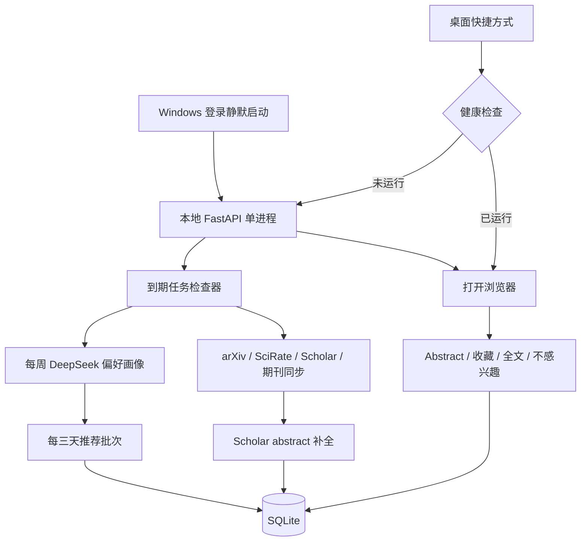

# arXiv Updater 单用户本地化重构工程计划

- 状态：需求已确认，可进入编码阶段
- 编写日期：2026-08-07
- 目标平台：Windows 本地个人使用
- 当前分支基线：`main`，编写计划时 HEAD 为 `064e31b`

## 1. 已确认的产品决策

以下决策已经由用户确认，编码时不需要再次询问：

1. “全部更新”严格按照论文进入本地论文库的时间倒序排列，不做个性化排序。
2. 只有“本周精选”使用个性化推荐排序。
3. 程序在 Windows 登录后静默自启，保证定时同步可以执行。
4. 桌面快捷方式负责启动或唤醒程序并打开页面；已经运行时不得重复启动服务。
5. 用户会申请 Semantic Scholar API key。项目需要预留：

   ```dotenv
   SEMANTIC_SCHOLAR_API_KEY=
   ```

   真实 key 只能写入被 Git 忽略的本地 `.env`，不得写入源码、测试、日志或提交历史。设置页可以显示“已配置/未配置”，但不得回显 key。
6. 删除现有 21 条 `INTERESTED` 互动记录，不将其用于新偏好画像。
7. 删除逐篇 DeepSeek 总结功能；“感兴趣 · 查看总结”改成“查看 Abstract”。
8. 点击“查看 Abstract”本身代表感兴趣，必须记录到本地互动历史。
9. 图标采用原创设计，并在编码阶段使用图像生成功能生成，不复用远端运行时资源。

## 2. 本次重构的目标

把当前“面向小组、可部署到服务器”的系统，收缩成一个简单、可靠的 Windows 单用户本地应用：

- 无登录、注册、邀请、角色和管理员概念。
- 无 Docker、PostgreSQL、独立 worker 和服务器运维脚本。
- 只监听 `127.0.0.1`，不向局域网或公网暴露。
- SQLite 保存论文、互动、偏好画像、推荐批次和同步状态。
- 单进程 FastAPI + 内嵌 APScheduler。
- Windows 登录后静默运行；桌面双击直接打开。
- 外部来源按各自可调频率更新。
- DeepSeek 用于每周总结用户偏好、每三天批量匹配推荐，不再用于逐篇摘要改写。

## 3. 非目标

本次不要实现：

- 多用户、团队共享、远端访问或云部署。
- PostgreSQL、Docker、反向代理、域名、HTTPS 或服务器监控。
- PDF 下载、PDF 保存、全文解析或向量数据库。
- 用 LLM 编造或补写缺失 abstract。
- 模型微调。所谓“偏好模型”是可审计的结构化偏好画像，不是 fine-tuning。
- 移动端原生应用或桌面原生 GUI；仍然使用本地网页。

## 4. 当前状态快照

编码前必须重新核对数据库和 Git 状态。编写本计划时的快照如下：

### 4.1 数据库

- 论文总数：683
- arXiv 论文：500，缺 abstract：0
- Google Scholar 论文：183，缺 abstract：183
- 用户：1 个管理员
- 邀请：0
- 重点作者：2
- 作者关注关系：2
- 自定义期刊源：0
- 互动：
  - `INTERESTED`：21，按用户要求删除
  - `FULLTEXT`：2，保留
  - `DISMISSED`：3，保留
  - `SAVED`：0，未来仍保留收藏功能
- 逐篇 AI 总结：8，随旧功能删除

### 4.2 代码行为

- `web.py` 当前把“本周精选”限制为 20 篇，其他视图限制为 100 篇。
- `scheduler.py` 的每日 `all` 同步实际包含 Scholar，随后每周又额外同步 Scholar，存在重复调度。
- `sources/scholar.py` 只读取 SerpAPI Author Articles 的标题、作者、年份、链接和引用量，没有 abstract 字段。
- `services/ranking.py` 当前只是词频余弦相似度加固定权重，没有调用 DeepSeek。
- `services/llm.py` 当前为逐篇论文生成结构化摘要。
- 当前非浏览器基线：24 项测试通过，Ruff 通过。

### 4.3 工作区注意事项

编写本计划时有以下用户文件未跟踪：

- `AGENTS.md`
- `server.stdout.log`
- `server.stderr.log`

后续编码必须保留它们，不得擅自删除、覆盖或随代码一起提交。每次提交只暂存本阶段明确修改的文件。

## 5. 目标架构



核心原则：页面请求只读取数据库并记录轻量互动；抓取、补摘要、偏好总结和推荐生成均在后台执行，不能让首页等待外部 API。

## 6. 删除范围

### 6.1 删除文件

- `Dockerfile`
- `compose.yaml`
- `docs/deployment.md`
- `scripts/backup.sh`
- `scripts/restore.sh`
- `src/arxiv_updater/auth.py`
- `src/arxiv_updater/templates/login.html`
- `src/arxiv_updater/templates/register.html`
- 旧逐篇总结模板 `templates/partials/paper_detail.html`，由 abstract 面板替代
- 只服务于旧逐篇总结的测试

### 6.2 删除依赖和命令

从 `pyproject.toml` 删除：

- `psycopg[binary]`
- `pwdlib[argon2]`
- 如果移除 SessionMiddleware 后不再被间接需要，则删除直接依赖 `itsdangerous`

保留 `python-multipart`，因为设置页和论文操作仍使用表单。

从 CLI 删除：

- `create-admin`
- `create-invite`
- `migrate-sqlite-to-postgres`
- `worker`

保留或简化：

- `serve`
- `sync`
- `doctor`
- 本地数据库迁移能力
- 安装 Windows 快捷方式的命令或脚本

### 6.3 删除网页能力

- `/login`
- `/logout`
- `/register`
- `/admin`
- `/admin/invites`
- 所有角色判断、会话认证和管理员文案

首页、设置和论文交互路由直接以单用户本地模式工作。

## 7. 数据模型与迁移

### 7.1 迁移安全要求

1. 在触碰真实数据库前，使用 SQLite backup API 创建带时间戳的完整备份。
2. 先在数据库副本上执行 Alembic upgrade，并验证行数和关键数据。
3. 迁移代码必须允许应用启动时安全重复检查，但不能重复复制互动或作者。
4. 真实迁移失败时停止启动并明确显示备份路径，不得继续写库。

### 7.2 保留的表或数据

- `papers`
- `paper_sources`
- `tracked_authors`
- `journal_subscriptions`
- `sync_runs`
- `api_usage`，但移除 `user_id` 和“全组/每用户”概念

### 7.3 删除的表

- `users`
- `invites`
- `author_follows`
- `paper_summaries`

只有一个现有用户，因此把该用户的 `interests` 迁移到新的单例偏好设置即可。现有两位 `tracked_authors` 直接保留，删除中间的关注关系表。

### 7.4 互动表

将 `interactions` 改成单用户结构：

- 删除 `user_id`
- 互动类型改为：
  - `ABSTRACT_VIEWED`
  - `SAVED`
  - `FULLTEXT`
  - `DISMISSED`
- 对 `(paper_id, kind)` 建唯一约束，保证操作幂等
- 可保留 `weight`，但 DeepSeek画像应使用明确的信号标签，而不是只读取一个浮点数
- 迁移时删除全部 21 条旧 `INTERESTED`
- 迁移并保留 2 条 `FULLTEXT` 和 3 条 `DISMISSED`

### 7.5 新增建议表

#### `app_preferences`（单例）

- `id`
- `manual_interests`
- `profile_summary`
- `profile_json`
- `profile_model`
- `profile_prompt_version`
- `profile_generated_at`
- `profile_interaction_count`
- `profile_dirty_since`
- `created_at`
- `updated_at`

`profile_json` 至少包含：

```json
{
  "topics": [],
  "methods": [],
  "physical_systems": [],
  "preferred_authors": [],
  "avoid_topics": [],
  "summary": ""
}
```

#### `source_schedules`

- `source`，主键：`arxiv`、`scirate`、`scholar`、`journals`
- `enabled`
- `interval_days`
- `last_attempt_at`
- `last_success_at`
- `next_due_at`
- `updated_at`

#### `recommendation_batches`

- `id`
- `generated_at`
- `window_start`
- `window_end`
- `profile_generated_at`
- `model`
- `prompt_version`
- `status`
- `fallback_used`
- `error`

#### `recommendation_items`

- `batch_id`
- `paper_id`
- `position`
- `llm_score`
- `final_score`
- `reason`
- 对 `(batch_id, paper_id)` 建唯一约束

### 7.6 Paper 摘要追踪字段

为 `papers` 增加或以等价结构保存：

- `abstract_source`
- `abstract_match_confidence`
- `abstract_checked_at`
- `abstract_status`：`available`、`missing`、`pending`、`failed`
- 可选 `semantic_scholar_id`

不得覆盖已有非空 abstract，除非新来源是相同论文的更可信原始来源且有明确测试。

## 8. 更新调度

### 8.1 默认值

| 来源 | 默认间隔 |
|---|---:|
| arXiv | 1 天 |
| SciRate | 3 天 |
| Google Scholar | 7 天 |
| 重点期刊 | 7 天 |

### 8.2 调度机制

- 应用启动后立即执行一次 `run_due_jobs()`。
- APScheduler 每 15 分钟检查一次到期任务。
- 到期依据是每个来源的 `last_success_at + interval_days`。
- 来源失败后建议 6 小时再重试，不把失败时间当成成功时间。
- 使用进程内锁和数据库运行状态，避免同一来源并发同步。
- Windows 登录自启使程序常驻；如果机器关机或休眠，恢复后的下一次检查必须补跑过期任务。
- 设置页修改频率后立即重新计算 `next_due_at`。

### 8.3 设置页

每个来源显示：

- 启用开关
- “每 N 天”数字输入或选择器
- 上次成功时间
- 下次计划时间
- 最近错误
- “立即更新”按钮

允许合理范围，例如 1–30 天；服务端必须校验，不信任表单值。

## 9. 各来源改造

### 9.1 arXiv

- 默认每天同步。
- 保留增量窗口和一天回退，防止边界遗漏。
- 保持请求节流、缓存和最多抓取数量。
- arXiv abstract 是该来源的可信原始摘要。

### 9.2 SciRate

- 默认每三天同步。
- 使用 SciRate 的三日范围，即 `range=3`，而不是默认单日页面。
- 读取最近三天结果后，以票数排序。
- 当前“前 10 或至少 5 票”为热门的规则可以保留为初始版本。
- 每次成功同步前后必须重算当前热门集合，并清除已经离开三日窗口的旧 `is_scirate_hot`，避免永久热门。
- 2026-08-07 审计时直接请求 SciRate 返回过 `403`。不得绕过站点访问控制；继续保持低频、有限重试和缓存。失败时保留上次成功数据并在设置页显示错误。

参考：[SciRate 三日视图](https://scirate.com/?range=3)

### 9.3 Google Scholar / SerpAPI

- 默认每周同步。
- 继续使用 `google_scholar_author`，每位重点作者最多读取 100 篇并按 `pubdate` 排序。
- SerpAPI Author Articles 响应没有 abstract，这是接口能力限制，不是当前解析遗漏。
- Scholar 同步完成后，把新建或仍缺摘要的论文交给 abstract enrichment 队列。
- 继续保留 SerpAPI 月度请求预算和使用量记录，但删除“全组”文案。

参考：[SerpAPI Google Scholar Author Articles API](https://serpapi.com/google-scholar-author-articles)

### 9.4 重点期刊

- 默认每周同步。
- 保留 Nature、Nature Physics、PRL。
- 保留自定义公开 HTTPS RSS/Atom 源，但不再称为管理员功能。
- 单个期刊失败不能阻断其他期刊；设置页逐项或汇总显示错误。

## 10. Scholar abstract 补全

### 10.1 补全顺序

1. **本地合并**：优先通过 arXiv ID、DOI、规范化标题、作者和年份匹配已有论文。
2. **Semantic Scholar title match**：调用 `/graph/v1/paper/search/match`，请求：
   - `title`
   - `abstract`
   - `authors`
   - `year`
   - `externalIds`
3. **arXiv 回源**：若 Semantic Scholar 返回 arXiv ID，用 arXiv API 获取原始 abstract。
4. **论文页元数据兜底**：只读取明确的公开 `citation_abstract` 或等价元数据；遇到 403、登录墙或结构不明时放弃。
5. 没找到时标记为 `missing`，下次 Scholar 周期再重试，但应设置检查冷却时间。

### 10.2 匹配门槛

可接受条件：

- DOI 完全一致；或
- arXiv ID 完全一致；或
- 规范化标题相似度至少 0.95，并且至少一位作者姓氏重合，年份相同或相差不超过 1。

不满足门槛的结果不得写入 abstract。记录匹配置信度和来源，便于排查误匹配。

### 10.3 API key

- 新增 `Settings.semantic_scholar_api_key`。
- HTTP 请求在配置时发送 `x-api-key`。
- 未配置时允许匿名、严格节流的后台补全，但不得因 `429` 阻塞其他来源。
- 对 `429` 和 5xx 使用指数退避与抖动。
- 设置页只显示配置状态。

Semantic Scholar 官方提供单篇标题匹配、abstract 和外部 ID 字段；匿名端点使用共享限额，配置 key 更稳定：

- [Academic Graph API](https://api.semanticscholar.org/api-docs/graph)
- [Semantic Scholar API Overview](https://www.semanticscholar.org/product/api)

### 10.4 点击缺摘要论文

- 点击仍写入 `ABSTRACT_VIEWED`。
- 如果当前没有 abstract，把论文标记为待补全并触发轻量后台任务。
- 返回面板提示“暂未找到 abstract，已加入补全队列”，而不是返回 DeepSeek 错误。
- 成功补全后刷新页面即可看到原文。

## 11. Abstract 交互与论文卡片

替换旧路由和模板：

- 旧：`POST /papers/{paper_id}/interested`
- 新：`POST /papers/{paper_id}/abstract`

新路由流程：

1. 检查论文存在。
2. 幂等记录 `ABSTRACT_VIEWED`。
3. 有 abstract 时直接返回原始英文摘要面板。
4. 无 abstract 时排队补全并返回状态面板。

论文卡片按钮改成：

```text
查看 Abstract
```

面板只显示：

- Abstract 原文
- Abstract 来源（可用时）
- 全文链接
- DOI 链接

保留：

- 收藏切换
- 不感兴趣
- 阅读全文及 `FULLTEXT` 记录

删除：

- TL;DR
- Key contributions
- Methods
- AI 重试按钮
- “正在生成总结”状态

## 12. DeepSeek 偏好画像

### 12.1 输入信号

- `ABSTRACT_VIEWED`：普通正向
- `SAVED`：强正向
- `FULLTEXT`：强正向
- `DISMISSED`：负向
- 手工填写的研究兴趣：冷启动先验

对于每个互动论文，发送：

- 本地 paper ID
- title
- authors
- abstract；缺失时明确标记 unavailable
- 互动类型
- 互动时间

不要发送用户邮箱、姓名、API key、本地路径或其他隐私信息。

### 12.2 生成时机

- 当前画像不存在；或
- 距上次成功画像至少 7 天且出现新互动；或
- 用户在设置页点击“立即重建”。

如果一周内没有新互动，可以更新时间检查记录但不重复调用模型。

### 12.3 输入规模

- 初始实现最多读取最近 500 个唯一互动论文。
- 收藏和不感兴趣记录优先保留；普通 abstract 查看可按时间截断。
- 同一论文有多个正向信号时合并为一个条目并标记最强信号。

### 12.4 输出

使用 JSON 输出和 Pydantic 严格校验。保存模型名、prompt version、生成时间和 token 用量。

当前 `deepseek-v4-flash` 支持 JSON 输出和长上下文，适合批处理：

[DeepSeek 官方模型与价格](https://api-docs.deepseek.com/quick_start/pricing/)

## 13. 本周精选推荐

### 13.1 批次频率

- 每三天生成一个推荐批次。
- 应用启动时如果最近成功批次已超过三天，立即后台生成。
- 首页始终先显示最近成功批次；生成新批次时不能让旧页面消失。

### 13.2 候选集合

- 首选最近 7 天发布或进入论文库的论文。
- 排除 `DISMISSED`。
- 尽量排除过去 30 天已经推荐过且没有新版本的论文。
- 优先等待或触发 Scholar 摘要补全，但缺摘要不能让整个批次失败。
- 如果严格候选不足 50，从最近 30 天未推荐论文中补齐，并标记为补充推荐。

### 13.3 DeepSeek 排序

- 将当前偏好画像和候选论文按 40–60 篇一批发送给 DeepSeek。
- 要求模型为每篇返回：
  - `paper_id`
  - `preference_score`，0–100
  - 简短中文 `reason`
- Pydantic 验证 paper ID 必须来自本批输入，忽略未知或重复 ID。
- DeepSeek 对每个有资格的候选至少评估一次，不能只对词频算法选出的很小子集评分。

### 13.4 最终分数

建议初始权重：

- DeepSeek 偏好匹配：70%
- 新鲜度：10%
- 重点作者：8%
- SciRate 热度：7%
- 重点期刊：5%

权重集中定义并可测试，不散落在模板或路由中。

### 13.5 数量要求

- 每个成功批次至少 50 篇。
- 首页默认完整展示该批次 50 篇。
- 如果候选总数客观不足，页面必须说明实际数量与补充范围，不能静默只显示 20 篇。

### 13.6 失败回退

DeepSeek调用失败、格式无效或额度不足时：

- 使用本地确定性排序生成至少 50 篇（候选足够时）。
- `recommendation_batches.fallback_used = true`。
- 设置页显示错误，但首页继续可用。
- 本地旧词频算法只作为回退，不再作为主要推荐器。

## 14. “全部更新”与其他视图

### 14.1 全部更新

- 查询条件：`discovered_at >= now - 30 days`。
- 排序：`discovered_at DESC`，以 ID 作为稳定次序。
- 不使用偏好分数。
- 支持搜索和分类筛选。
- 用户不改变筛选条件即可连续浏览至少 300 篇。
- 建议每批 100 篇，通过 HTMX“加载更多”或自动加载，后端不得再有 100 篇总上限。

### 14.2 本周精选

- 只读取最近成功的推荐批次。
- 显示模型生成的简短推荐理由。
- 不显示难以解释的内部浮点总分；如需调试，仅在日志或开发模式查看。

### 14.3 其他视图

保留：

- 重点作者
- SciRate 热门
- arXiv
- 重点期刊
- 收藏

这些视图可以按入库/发布时间倒序，不调用 DeepSeek。后续如需进一步精简导航，可在完成核心重构后再评估，不要在第一阶段删除数据入口。

## 15. 设置页与视觉简化

设置页建议分成四块：

1. **我的研究偏好**
   - 手工兴趣描述
   - 当前 DeepSeek 偏好总结
   - 上次生成时间
   - “立即重建”
2. **重点作者**
   - 添加/删除 Google Scholar 作者
3. **期刊来源**
   - 默认期刊说明
   - 添加/删除自定义 HTTPS RSS/Atom
4. **更新与外部服务**
   - 四个来源频率
   - 上次/下次同步
   - 立即更新
   - SerpAPI、DeepSeek、Semantic Scholar 的配置状态和总用量

网页整体：

- 删除用户菜单、退出按钮、管理员区域和成员邀请。
- 删除左侧“排序会逐渐适应你”的说明卡。
- 优先使用单栏内容和紧凑顶部标签导航。
- 保留已有本地 arXiv 品牌 SVG，不引入外部运行时图片。
- 论文卡片突出标题、作者、来源、时间、推荐理由和 Abstract 操作。
- 保持移动端可用，但桌面是主要验收尺寸。

## 16. Windows 启动、快捷方式与图标

### 16.1 两种启动模式

1. **Windows 登录自启**
   - 静默启动本地服务和调度器。
   - 不自动弹出浏览器。
2. **桌面快捷方式**
   - 先访问 `/health`。
   - 服务已运行：直接打开 `http://127.0.0.1:8000/`。
   - 未运行：静默启动、等待健康检查成功、再打开浏览器。

### 16.2 启动器

建议新增一个无控制台启动器，例如：

- `scripts/launch_arxiv_updater.pyw`

行为要求：

- 使用当前项目 `.venv\Scripts\pythonw.exe`。
- 工作目录固定为项目根目录。
- 设置正确的 Python 模块路径。
- 日志写入 Git 忽略的 `data/logs/`。
- 通过健康检查和端口绑定避免重复实例。
- 启动失败时写清晰日志；桌面模式可以弹出简短错误提示。

可以新增：

- `scripts/install_windows_shortcuts.ps1`

用于创建：

- 桌面 `arXiv Updater.lnk`
- Windows Startup 文件夹中的静默启动快捷方式

快捷方式使用绝对路径；若项目目录移动，需要重新运行安装脚本。

### 16.3 图标

编码阶段调用图像生成功能，设计原则：

- 原创，不直接把官方 arXiv Logo 当作应用图标。
- 方形、圆角、无小字。
- 主体为抽象论文页。
- arXiv 酒红色为主色，深绿色环形更新轨迹为辅色。
- 在 16×16 下仍可辨识，避免细线和复杂公式。

产物：

- 1024×1024 PNG 源图
- 包含 16、24、32、48、64、128、256 像素的 `.ico`
- 源图和最终 ICO 均纳入仓库
- 快捷方式使用最终 ICO

## 17. 配置清理

从 `.env.example` 删除服务器专用项：

- `APP_ENV`
- `APP_SECRET_KEY`
- `BASE_URL`
- `LOCAL_DEV_AUTO_LOGIN`
- PostgreSQL 相关说明
- `SUMMARY_USER_WEEKLY_LIMIT`

数据库固定为本地 SQLite；测试可以继续通过测试配置注入临时数据库路径，但生产配置不再宣传 PostgreSQL。

保留并整理：

```dotenv
TIMEZONE=Asia/Shanghai
SERPAPI_API_KEY=
SERPAPI_MONTHLY_QUERY_BUDGET=240
SEMANTIC_SCHOLAR_API_KEY=
DEEPSEEK_API_KEY=
LLM_BASE_URL=https://api.deepseek.com
LLM_MODEL=deepseek-v4-flash
LLM_THINKING_ENABLED=false
LLM_MONTHLY_TOKEN_BUDGET=5000000
SOURCE_CACHE_DIR=data/cache
```

DeepSeek偏好总结和推荐重排都记录到 `api_usage`，操作名建议使用：

- `preference_profile`
- `recommendation_rerank`

## 18. 预计文件变更

### 18.1 重点修改

- `src/arxiv_updater/config.py`
- `src/arxiv_updater/db.py`
- `src/arxiv_updater/models.py`
- `src/arxiv_updater/cli.py`
- `src/arxiv_updater/web.py`
- `src/arxiv_updater/scheduler.py`
- `src/arxiv_updater/services/interactions.py`
- `src/arxiv_updater/services/ranking.py`
- `src/arxiv_updater/services/sync.py`
- `src/arxiv_updater/sources/scholar.py`
- `src/arxiv_updater/sources/scirate.py`
- `src/arxiv_updater/templates/base.html`
- `src/arxiv_updater/templates/home.html`
- `src/arxiv_updater/templates/settings.html`
- `src/arxiv_updater/templates/partials/paper_card.html`
- `src/arxiv_updater/static/app.css`
- `pyproject.toml`
- `.env.example`
- `README.md`
- `docs/architecture.md`
- `docs/sources.md`

### 18.2 建议新增

- `src/arxiv_updater/services/abstracts.py`
- `src/arxiv_updater/services/preferences.py`
- `src/arxiv_updater/services/recommendations.py`
- `src/arxiv_updater/templates/partials/abstract_panel.html`
- 新 Alembic migration，例如 `0003_single_user_local_app.py`
- `scripts/launch_arxiv_updater.pyw`
- `scripts/install_windows_shortcuts.ps1`
- 图标 PNG 和 ICO
- 对应单元、迁移、路由和浏览器测试

### 18.3 删除

见第 6 节。删除前检查是否仍有 import、路由、测试或文档引用。

## 19. 测试计划

### 19.1 数据迁移

- 在当前数据库副本上升级成功。
- 683 篇论文全部保留。
- 2 位重点作者保留。
- 21 条 `INTERESTED` 被删除。
- 2 条 `FULLTEXT`、3 条 `DISMISSED` 保留。
- 用户手工兴趣迁移到单例偏好设置。
- 旧用户、邀请、关注关系和 paper summary 表被移除。
- Alembic schema check 无漂移。

### 19.2 调度

- 四个来源默认频率正确。
- 未到期来源不执行。
- 到期来源执行。
- 失败后按重试窗口调度。
- 修改间隔会更新下次时间。
- 启动时会补跑过期任务。
- 同一来源不能并发运行。

### 19.3 Abstract

- 有摘要论文点击后显示原文并记录一次 `ABSTRACT_VIEWED`。
- 重复点击不产生重复记录。
- 缺摘要论文点击后记录兴趣并进入补全队列。
- DOI/arXiv 精确匹配优先。
- 模糊标题但作者不符时拒绝写入。
- Semantic Scholar `429` 不影响其他同步。
- 已有 abstract 不被低可信结果覆盖。

### 19.4 推荐

- 一周内无新互动时不重复生成画像。
- 超过一周且有新互动时生成新画像。
- DeepSeek输入包含 title、authors、abstract 和信号类型。
- 模型输出中的未知 paper ID 被拒绝。
- 候选足够时每批至少 50 篇。
- DeepSeek失败时仍生成回退批次。
- 已 `DISMISSED` 论文不会推荐。

### 19.5 列表和网页

- `/` 不再重定向登录。
- 登录、注册、管理员路由不存在。
- “全部更新”按 `discovered_at` 倒序。
- 能加载至少 300 篇而不是总共 100 篇。
- “本周精选”显示最新推荐批次的至少 50 篇。
- 按钮文本和 abstract 面板正确。
- 页面没有旧 AI summary 文案。
- 桌面和窄屏布局无明显溢出。

### 19.6 Windows 集成

- 登录自启快捷方式存在且不打开浏览器。
- 桌面快捷方式存在并使用新图标。
- 未运行时可启动、健康检查并打开网页。
- 已运行时不会产生第二个服务进程。
- 启动过程没有可见命令行窗口。

### 19.7 验证命令

至少执行：

```powershell
.venv\Scripts\python -m pytest -m "not browser"
.venv\Scripts\python -m ruff check src tests
git diff --check
```

浏览器测试环境可用时再执行完整 pytest，并实际检查首页、设置、Abstract 展开、300 篇加载和 50 篇精选。

## 20. 实施顺序与提交策略

遵循 `AGENTS.md`：每个重大阶段完成并验证后立即提交，并推送当前分支；不要积累成一个巨大提交。

### 阶段 1：单用户数据层

- 先备份并复制数据库用于迁移演练。
- 新增 migration 和新表。
- 删除认证/邀请/角色依赖。
- 保留并迁移有效数据，删除指定 21 条旧兴趣记录和 8 条旧总结。
- 更新迁移测试。
- 验证后提交、推送。

### 阶段 2：调度和来源

- 实现可调来源频率和启动补跑。
- 修正 Scholar 重复调度。
- SciRate 改为三日范围并清理过期热门标记。
- 增加 Semantic Scholar abstract enrichment。
- 验证后提交、推送。

### 阶段 3：Abstract 交互和偏好画像

- 替换逐篇总结路由和模板。
- 实现新的互动信号。
- 实现每周 DeepSeek 偏好画像。
- 验证后提交、推送。

### 阶段 4：推荐批次和列表数量

- 实现三日推荐批次、模型重排和失败回退。
- 本周精选至少 50。
- 全部更新按入库倒序并可加载至少 300。
- 验证后提交、推送。

### 阶段 5：UI、Windows 启动与图标

- 简化首页和设置页。
- 用图像生成功能生成图标并转换 ICO。
- 添加静默启动器、桌面快捷方式和登录自启。
- 在真实 Windows 环境进行端到端检查。
- 验证后提交、推送。

### 阶段 6：最终清理

- 删除 Docker/PostgreSQL/服务器文档和残留 import。
- 更新 README、架构和来源文档。
- 在真实数据库备份后执行最终迁移。
- 运行全套测试和浏览器检查。
- 提交、推送并记录最终启动方式及备份位置。

## 21. 最终验收标准

- 双击桌面图标即可打开应用，无需命令行。
- Windows 登录后程序在后台静默运行。
- 服务只监听本机回环地址。
- 页面没有账户、邀请、管理员和组共享概念。
- 仓库不再包含远端部署和 PostgreSQL 功能。
- 四类来源频率可调，默认分别为 1、3、7、7 天。
- SciRate 读取三日视图且不会保留过期热门标记。
- Scholar 缺摘要会通过可信来源补全，无法补全时不会伪造。
- 点击“查看 Abstract”会展示原文并记录兴趣。
- 现有 21 条旧 `INTERESTED` 已按要求删除。
- DeepSeek每周生成偏好画像，每三天参与推荐匹配。
- “本周精选”候选足够时至少 50 篇。
- “全部更新”按入库时间倒序，可连续浏览至少 300 篇。
- DeepSeek或任一外部来源失败时，已有论文仍可浏览。
- 真实数据库迁移前存在可恢复备份。
- 所有测试、代码检查、浏览器检查和 Windows 快捷方式检查通过。

## 22. 外部参考

- [SerpAPI Google Scholar Author Articles API](https://serpapi.com/google-scholar-author-articles)
- [Semantic Scholar Academic Graph API](https://api.semanticscholar.org/api-docs/graph)
- [Semantic Scholar API Overview](https://www.semanticscholar.org/product/api)
- [SciRate 三日视图](https://scirate.com/?range=3)
- [DeepSeek 官方模型与价格](https://api-docs.deepseek.com/quick_start/pricing/)

## 23. 新编码窗口的第一步

新窗口读取本文件后，应先：

1. 读取根目录 `AGENTS.md`。
2. 检查 `git status --short --branch`，保护用户已有未跟踪文件。
3. 重新查询数据库行数，确认与第 4 节相比是否发生变化。
4. 创建真实数据库的时间戳备份和一个迁移测试副本。
5. 从“阶段 1：单用户数据层”开始，不要直接在真实数据库上试错。
